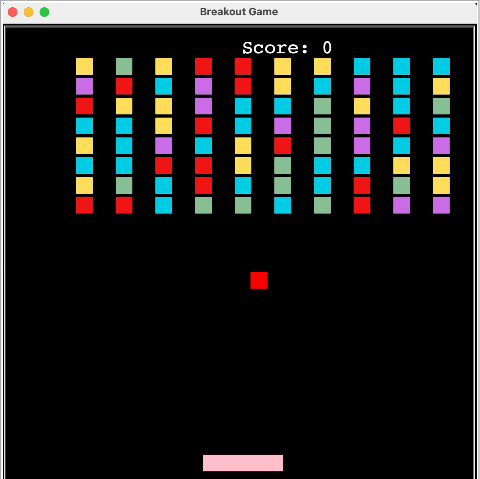

```markdown
# Breakout Game

Welcome to the Breakout Game! This project is a classic implementation of the Breakout game using Python's Turtle graphics library.



## Table of Contents

- [Introduction](#introduction)
- [Features](#features)
- [Installation](#installation)
- [Usage](#usage)
- [Game Controls](#game-controls)
- [Contributing](#contributing)
- [License](#license)

## Introduction

Breakout is an arcade game developed by Atari, Inc. In this game, the player controls a paddle to hit a ball and break bricks.
The goal is to destroy all the bricks without letting the ball fall off the screen.

This project is implemented in Python using the Turtle graphics library, which makes it easy to create graphics and animations.

## Features

- Classic Breakout gameplay
- Simple and intuitive controls
- Score tracking

## Installation

1. Make sure you have Python installed on your machine. You can download it from [python.org](https://www.python.org/).
2. Clone this repository to your local machine using the following command:

    ```bash
    git clone https://github.com/yourusername/breakout-game.git
    ```

3. Navigate to the project directory:

    ```bash
    cd breakout-game
    ```

4. (Optional) Create and activate a virtual environment:

    ```bash
    python -m venv venv
    source venv/bin/activate  # On Windows use `venv\Scripts\activate`
    ```

5. Install the required dependencies:

    ```bash
    pip install -r requirements.txt
    ```

    install the Turtle library using:

    ```bash
    pip install PythonTurtle
    ```

## Usage

To start the game, run the following command:

```bash
python breakout.py
```

This will launch the game window, and you can start playing immediately.

## Game Controls

- **Left Arrow Key**: Move the paddle left
- **Right Arrow Key**: Move the paddle right

## Contributing

Contributions are welcome! If you would like to contribute to this project, please follow these steps:

1. Fork the repository.
2. Create a new branch:

    ```bash
    git checkout -b feature/your-feature-name
    ```

3. Make your changes and commit them:

    ```bash
    git commit -m 'Add some feature'
    ```

4. Push to the branch:

    ```bash
    git push origin feature/your-feature-name
    ```

5. Create a pull request.

Please make sure your code follows the project's coding standards and includes appropriate tests.

## License

This project is licensed under the MIT License. See the [LICENSE](LICENSE) file for details.

---

Thank you for checking out my Breakout game! I hope you enjoy playing it as much as I enjoyed creating it.
