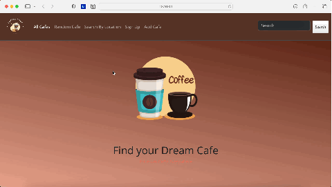

# Cafe Finder

Welcome to the Cafe Finder project! 
This application helps users find their dream cafe by location and other preferences. 
The project is built using Flask, Python, and SQLite.



## Table of Contents

- [Introduction](#introduction)
- [Features](#features)
- [Installation](#installation)
- [Usage](#usage)
- [Contributing](#contributing)
- [License](#license)

## Introduction

Cafe Finder is a web application that allows users to search for cafes based on various criteria such as location, ratings, and more. The backend is powered by Flask, and the data is stored in an SQLite database.

## Features

- Search for cafes by location
- View detailed information about each cafe
- User authentication and profile management
- Add and review cafes

## Installation

1. Make sure you have Python installed on your machine. You can download it from [python.org](https://www.python.org/).
2. Clone this repository to your local machine using the following command:

    ```bash
    git clone https://github.com/yourusername/cafe-finder.git
    ```

3. Navigate to the project directory:

    ```bash
    cd cafe-finder
    ```

4. (Optional) Create and activate a virtual environment:

    ```bash
    python -m venv venv
    source venv/bin/activate  # On Windows use `venv\Scripts\activate`
    ```

5. Install the required dependencies:

    ```bash
    pip install -r requirements.txt
    ```

## Usage

To start the application, run the following command:

```bash
python app.py
```

This will start the Flask development server. Open your browser and navigate to `http://127.0.0.1:5000/` to access the application.

## Contributing

Contributions are welcome! If you would like to contribute to this project, please follow these steps:

1. Fork the repository.
2. Create a new branch:

    ```bash
    git checkout -b feature/your-feature-name
    ```

3. Make your changes and commit them:

    ```bash
    git commit -m 'Add some feature'
    ```

4. Push to the branch:

    ```bash
    git push origin feature/your-feature-name
    ```

5. Create a pull request.

Please make sure your code follows the project's coding standards and includes appropriate tests.

## License

This project is licensed under the MIT License. See the [LICENSE](LICENSE) file for details.

---

Thank you for checking out the Cafe Finder project! I hope you find it useful and enjoyable.
